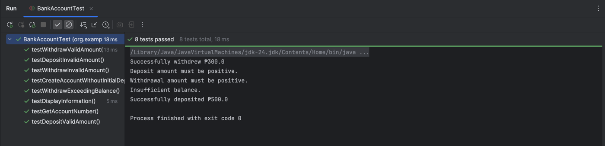
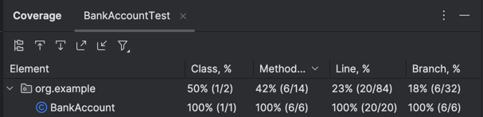

## Lab 2: Unit Testing

In the program you created for the Bank Account System, Perform unit testing on the BankAccount class.

- Deposit a valid amount 
- Deposit an invalid amount
- Withdraw a valid amount
- Withdraw an invalid amount 
- Withdraw an amount that exceeds the balance 
- Test the getAccountNumber() method 
- Test creation of Bank Account without deposits

## Sample Output

